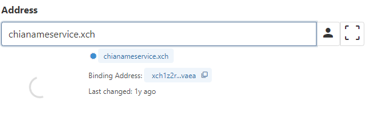

# API

## Resolve

**NOTE:** 
1. You can access the hosting service of CNS, or resolve it by yourself with or without this [reference code](https://github.com/SutuLabs/pawket-api)
2. We are still working towards a more decentralized solution like the mechanism in the inscription chain.

### API to resolve

Here you can resolve the address through our API for demonstration purpose.

**POST** https://walletapi.chiabee.net/Name/resolve

**Request:**
```json
{
    "queries": [
        {
            "name": "chianameservice.xch",
            "type": "address"
        }
    ]
}
```

**Response:**
```json
{
    "answers": [
        {
            "name": "chianameservice.xch",
            "type": "address",
            "time_to_live": 600,
            "data": "2fa8cc93dec82f50a7781ced27b6c2ee5a8e5efd1d70606b877c58bb8545e906",
            "proof_coin_name": "0x59cffe9b0d863c74e04bd41aad96f39ca74bf8494d09e74aa387ad2dbc81086d",
            "proof_coin_spent_index": 4952003,
            "nft_coin_name": "0x56506bca506dc262a27355a08f77d45c02bc7b48de09d1b1ab4d84864bd370df"
        }
    ]
}
```

the `data` is the Hex format of address, convert to xch address [by bech32m tool](https://mixch.dev/#/tools/address), and in this case, it should be: `xch1975vey77eqh4pfmcrnkj0dkzaedguhhar4cxq6u803vthp29ayrqp0ydw2`

## Verify Proof

The quick and dirty way is just resolve without verify, but to resist the malicious resolver, the client are persuade to verify the proof in the client side.

Here is the steps:

1. download coin data from blockchain for the proof coin
2. parse(uncurry) the coin and check the correctness of name and binding address
3. check the next coin of this proof coin is not spent (that the proof coin is the latest changes)

### API to check coin

Different client may have different way to get the coin details, here is one way to demonstrate this function.

**POST** https://walletapi.chiabee.net/Wallet/get-coin-solution

**Request:**
```json
{
    "coinIds": [
        "0x59cffe9b0d863c74e04bd41aad96f39ca74bf8494d09e74aa387ad2dbc81086d"
    ]
}
```

**Response:**
```json
[
    {
        "coin": {
            "amount": 1,
            "parent_coin_info": "0x804037b1362351a6e9b29f0dc3a821a81143dc499fd953a1b9573ed95fc4836e",
            "puzzle_hash": "0x10d14864451e4c2e6e94d58512b29f7de603e77713ed62e4b23f1b8af44f3b0d"
        },
        "puzzle_reveal": "0xff02ffff01ff02ffff0...",
        "solution": "0xffffa0793d3984ad2321...",
        "confirmed_index": 4946819,
        "spent_index": 4952003,
        "timestamp": 1707986063
    }
]
```

## UI

**Loading**

After resolving, client need to get detail of proof coin, then this loading state could tell user it is verifying.



**Verified**

After verifying, it could tell user it's verified.


**Not Found**

If the address is not found in the resolver, then the error may tell user.

