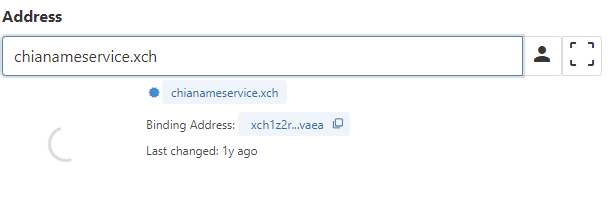
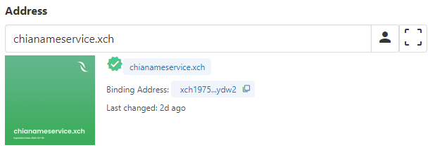
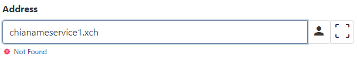

# Resolve

**NOTE:**

1. You can access the hosting service of CNS, or resolve it by yourself with or without this [reference code](https://github.com/SutuLabs/pawket-api)
2. We are still working towards a more decentralized solution like the mechanism in the inscription chain.

## Single resolve

Here you can resolve the address through our API for demonstration purpose.

**POST** https://walletapi.chiabee.net/Name/resolve

**Request:**

```json
{
  "queries": [
    {
      "name": "chianameservice.xch",
      "type": "address"
    }
  ]
}
```

**Response:**

```json
{
  "answers": [
    {
      "name": "chianameservice.xch",
      "type": "address",
      "time_to_live": 600,
      "data": "2fa8cc93dec82f50a7781ced27b6c2ee5a8e5efd1d70606b877c58bb8545e906",
      "proof_coin_name": "0x59cffe9b0d863c74e04bd41aad96f39ca74bf8494d09e74aa387ad2dbc81086d",
      "proof_coin_spent_index": 4952003,
      "nft_coin_name": "0x56506bca506dc262a27355a08f77d45c02bc7b48de09d1b1ab4d84864bd370df"
    }
  ]
}
```

| Field                  | Description                                                                                                      |
| ---------------------- | ---------------------------------------------------------------------------------------------------------------- |
| name                   | the CNS name                                                                                                     |
| type                   | resolving type, for reverse resolving, it could also be `name`                                                   |
| time_to_live           | the time in seconds that tells the client how long the resolution should be cached and then update.              |
| data                   | the resolving address in Hex format, convert to xch address [by bech32m tool](https://mixch.dev/#/tools/address) |
| proof_coin_name        | the last spent coin that prove the resolving is right                                                            |
| proof_coin_spent_index | the latest change time (a.k.a. proof coin spent time) which is represented in block height                                                      |
| nft_coin_name          | the nft represented the CNS, and hold all the NFT information                                                    |

**NOTE:**

- the `data` is in Hex format, and in this case, it should be: `xch1975vey77eqh4pfmcrnkj0dkzaedguhhar4cxq6u803vthp29ayrqp0ydw2`
- You can either get accurate block time from block chain or just roughly calculated like I did in Pawket here: [Code](https://github.com/SutuLabs/Pawket/blob/master/packages/pawket/src/components/Common/AddressField.vue#L223-L236)

## Reverse resolving

Sometime, we need to reverse resolving, from address to name, here is the example.

**POST** https://walletapi.chiabee.net/Name/resolve

**Request:**

```json
{
  "queries": [
    {
      "name": "2cf90f43d2e01dce3a590bf71b944c0adb9d6b0cd50f24473a37606f9a601378",
      "type": "name"
    }
  ]
}
```

**Response:**

```json
{
  "answers": [
    {
      "name": "slezisatoshi.xch",
      "type": "name",
      "time_to_live": 600,
      "data": "2cf90f43d2e01dce3a590bf71b944c0adb9d6b0cd50f24473a37606f9a601378",
      "proof_coin_name": "0x8549f5ac17c9ec80d00b2865ddde14040b7bb664fa23637cfdb822aead528043",
      "proof_coin_spent_index": 3247777,
      "nft_coin_name": "0x1dfa73a03ecd550074f35646553b7e5dd928b6fd9265597935142ddb62eae62e"
    }
  ]
}
```

If the address is resolving to multiple names, the earliest change would be responsed.


## Retrieve All

For some application, it's better to get all domain names at once, and resolve them locally with periodical update.

Here you can resolve the address through our API for demonstration purpose.

**GET** https://walletapi.chiabee.net/Name/all

**Response:**

```json
[
  {
    "nft_coin_name": "0x2a436bde91fa3535d44c7ccce7b216bc65be7171d628d1624d195a050274fd4b",
    "last_change_coin_name": "0xc6e8127b66c194caad44eadad66d18bfab37e0343a9c2be0be35aada79a9b971",
    "last_change_spent_index": 3224782,
    "name": "pawket.xch",
    "address": "d19c05a54dacbf2b40ff4843534c47976de90246c3fc42ac1f42ea81b434b8ea",
    "bindings": {
      "address": "d19c05a54dacbf2b40ff4843534c47976de90246c3fc42ac1f42ea81b434b8ea"
    }
  },
  {
    "nft_coin_name": "0x4ca2e68be9e7089bde96add07e5cec2b1fa13f5728f9dcfbb5c46d644cb05151",
    "last_change_coin_name": "0xa902271587fd5b96599c31eb592df940c3f36d08289b0d756ad49511de2fb617",
    "last_change_spent_index": 3225668,
    "name": "onlyfansnft.xch",
    "address": "7946dd4415470e985bbe94c4d0a953958d0c6d901dcab8762b27d36160d8462a",
    "bindings": {}
  }
]
```

the `address` is the Hex format of address, convert to xch address [by bech32m tool](https://mixch.dev/#/tools/address).

## UI

**Loading**

After resolving, client need to get detail of proof coin, then this loading state could tell user it is verifying.



**Verified**

After verifying, it could tell user it's verified.



**Not Found**

If the address is not found in the resolver, then the error may tell user.

