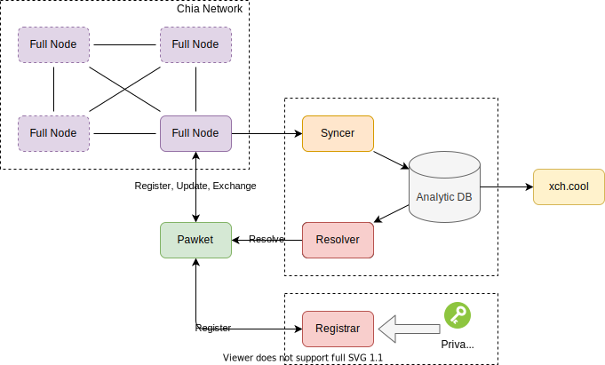

# Technical Architecture

- Full Node 全节点。用来实时获取Chia区块链上的数据。
- Syncer 同步器。用来将全节点上的数据进行实时分析，并存入数据库备查。
- Resolver 解析器。接受用户的域名解析请求，提供域名解析的结果。
- Registrar 注册器。接受用户的注册请求，提供注册域名的NFT Offer。确定域名合法性的核心私钥存在此处，需高安全级别的保护。
- Pawket 钱包。用户的区块链终端，可以进行去中心化的注册、解析、验证、更新和交易工作。
- xch.cool 概况网页。通过该网站的个性化网页可以看到账户所拥有的NFT、CAT、XCH等资产信息。

## 钱包的功能

- 注册：向注册器提交注册请求，如果该域名可用，则可以获得该域名的的NFT Offer，在钱包签名后直接向全节点发送交易完成注册。
- 解析：向解析器发起解析请求，提供域名获取对应的基本信息及NFT硬币信息。
- 验证：根据解析时获取的NFT硬币信息，通过全节点进行验证，验证1）该硬币为合法有效的域名NFT；2）与解析信息一致。
- 更新：构造更新NFT的交易信息，并提交至全节点上链。
- 交易：域名NFT全兼容正常的NFT，可以在所有能做NFT交易的市场上进行交易。

## Analytic DB

::: mermaid
erDiagram
    sync_coin_class {
        bigint id PK
        bytea coin_name
        bytea puzzle
        json parsed_puzzle
        bytea solution
        text mods
        json analysis
    }
    sync_block {
        bigint id PK
        bool is_tx_block
        bigint index
        bigint weight
        bigint iterations
        bigint cost
        bigint fee
        bytea generator
        bytea generator_ref_list
        json block_info
        bool tx_parsed
    }
:::

::: mermaid
erDiagram
    ext_singleton_record {
        bigint id PK
        bigint last_coin_class_id
        bytea singleton_coin_name
        int singleton_create_index
        bytea bootstrap_coin_name
        bytea creator_puzzle_hash
        bytea creator_did
        text type
    }
    ext_singleton_history {
        bigint id PK
        bigint coin_class_id
        bytea singleton_coin_name
        bytea this_coin_name
        int this_coin_spent_index
        bytea next_coin_name
        bytea p2_owner
        bytea did_owner
        text type
    }
:::

- type: "CatV2" | "DidV1" | "NftV1"

## 接口定义

### Resolver

- API: /resolve
    - Request:
        - queries: array
            - name: string 域名
            - type: string 解析类型，目前只支持`address`
    - Response:
        - answers: array
            - name: string 解析的域名
            - type: string 解析类型
            - time_to_live: number 域名的更新周期
            - data: string 解析的内容，每种类型不一样，`address`对应绑定的xch地址
            - proof_coin_name: string 证明解析结果的硬币名称，即该NFT UTXO的父硬币
            - proof_coin_spent_index: number 包含证明解析结果硬币区块的高度
            - nft_coin_name: string 该域名的NFT名称

### Registrar

- API: /register
    - Request:
        - name: string 域名
        - address: string 绑定的xch地址
        - content_hash: string 验证内容的哈希【暂未开放】
        - text: string 任意文字内容【暂未开放】
        - dns: string DNS记录【暂未开放】
        - pk: string 公钥信息【暂未开放】
    - Response:
        - name: string 域名
        - offer: string 注册域名的offer

- Register Offer Coins
    - Bootstrap Coin -> Launcher Coin
    - Launcher Coin (Singleton Coin) -> NFT Hint Coin
    - NFT Hint Coin -> Settlement Payment(NFT)
    - Settlement Payment(XCH) -> Registrar Address

## Name Registration

As shown in the above figure, the name registration process involves 5 major steps:
Generate Logic Signature
The desired name is used as input to a standardized TEAL program and compiled, thereby creating a Logic Signature from the resulting TEAL program.
Pay Name Registration fee to the escrow address
The user must pay the name registration fee to the smart contract's escrow account. The total price is dependent on the length of the name and the desired number of years.
Fund Logic Signature
In order to be able to opt-in to Registry Smart Contract, the Logic Signature must possess 1.2 ALGOs. To meet this requirement, the Logic Signature account is first funded from the future name owner's wallet.
Opt-In to Registry Smart Contract
Once the Logic Signature representing the desired name is funded with the required minimum balance, an Opt-In transaction is processed to allow the Logic Signature account to be able to allocate local storage on the Name Registry smart contract. This transaction is signed and sent using the Logic Signature account.
Add Owner's Address
After opting-in to the Name Registry smart contract, the name owner adds their wallet address as the owner of the name by adding a local storage byte key-value. The name owner mentions Logic Signature account address in the accounts array of the transaction.

## Name Lookup

## Name Transfer

## Name Binding