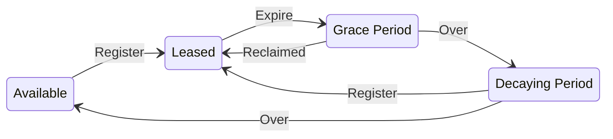

## Lifecycle

**Available Domains**

Domains that are available can be immediately leased. Users will be required to pay leasing fees for one or more years. Leasing fees will be dependent on the length of the domain name.

**Leased Domains**

Leased domains will be represented by ERC721 tokens. The owner of the token will be able to top up leasing fees, transfer the token, and make use of the token (i.e. by using the naming system).

**Grace Period**

If the registration of a leased domain expires, the domain will enter into a grace period. During this grace period, the owner of the domain will not be able to perform any actions using the token (e.g. setting records on the domain, transferring the domain, etc.). The owner will have the option of reclaiming the domain by paying the lease fees on the domain during this period.

**Decaying Period**

If an expired domain is not reclaimed during the grace period, it will enter into the Recycling Period. During this period, an auction is used to re-distribute the domain. 

### Registration

CNS domain names will be assigned through **retention**, **public registration**.
- The domain name of an important website will be retained for three years, and domain holders can verify the domain through their domain name certificate in a private manner.
- Domain names with 7 or more letters are open for public registration on a first-come-first-served basis.

To use the domain name, users must register a domain. A domain registration is a Chia NFT with some special properties:

- Domain registrations always have expiry dates. To keep a domain, users must make sure to renew the domain before it expires.
- Expired domains are sold at auction. Expired names that are not sold at auction can be registered by others.

### Renewal

- The renewal cycle is year based.
- Names have a minimum registration period of 1 year, and the maximum period is 10 years.

### Expiry

- If the domain name is not renewed by the expiration date, the name will enter a renewal grace period of 90 days, the user can renew it within such period.
- During the renewal grace period, the name would be invalid, and all modifications to it would be ignored.

carried out the “decaying price premium” [10], where the price of expired names will start at $2,000
combining with normal annual rent and will decrease linearly to normal annual rent in 28 days.

