# Registration



If you ever try to inspect the registration offer, you will find this offer is special, the trading NFT is not created yet, and will only be created when the offer is successfully accepted.

Beside this, what is the difference between the CNS and the standard NFT?

1. metadata updater changed

```diff
  - `singleton_top_layer_v1_1`
    - `SINGLETON_STRUCT`: ...
    - `INNER_PUZZLE`: `nft_state_layer`
      - `NFT_STATE_LAYER_MOD_HASH`: 0xa0a04d9f57764f54a43e4030befb4d80026e870519aaa66334aef8304f5d0393c2
      - `METADATA`: ...
-     - `METADATA_UPDATER_PUZZLE_HASH`: 0xa0fe8a4b4e27a2e29a4d3fc7ce9d527adbcaccbab6ada3903ccf3ba9a769d2d78b
+     - `METADATA_UPDATER_PUZZLE_HASH`: 0xa020ea3991407203334e6a705517f4cba83f7987353d883f0938633ce7e1740fad
      - `INNER_PUZZLE`: `nft_ownership_layer`
        - `NFT_OWNERSHIP_LAYER_MOD_HASH`: 0xa0c5abea79afaa001b5427dfa0c8cf42ca6f38f5841b78f9b3c252733eb2de2726
        - `CURRENT_OWNER`: 0x80
        - `TRANSFER_PROGRAM`: `nft_ownership_transfer_program_one_way_claim_with_royalties`
          - `SINGLETON_STRUCT`: ...
          - `ROYALTY_ADDRESS`: ...
          - `TRADE_PRICE_PERCENTAGE`: ...
        - `INNER_PUZZLE`: `p2_delegated_puzzle_or_hidden_puzzle`
          - `synthetic_public_key`: ...
```

the metadata updater can be found [here](https://github.com/SutuLabs/Pawket/blob/master/packages/cli/clvm/nft_metadata_updater_cns.clvm), while the official metadata updater can be found [here](https://github.com/Chia-Network/chia-blockchain/blob/main/chia/wallet/nft_wallet/puzzles/nft_metadata_updater_default.clsp), main changes is allow changes of custom binding information in the CNS NFT.

2. metadata changed

If you find any random CNS, and look into the metadata, you will find the extension fields.

```diff
  (
    (117 "https://storage.pawket.app/ipfs/QmS7wLEbCy1ppi3mTQCzYYNb7ZWJSP2kxtgrFH35sjfQy6?filename=helloworld.xch.jpg") 
    (104 . 0xe2fb68894b5dc73b656815a2cc5397eae737de9abe5b8015c296a282143bee93) 
    (28021 "https://storage.pawket.app/ipfs/QmNfDdWVAChsrds7oMmciaDrbDmu7B2S9t1w2Ax2K7GawM?filename=helloworld.xchmetadata.json") 
    (28008 . 0x2598205f6f12e1ef872dbdc1abd7fff173167177a3f6d9ff782946e9bdf2206e) 
    (27765) 
    (27752) 
    (29550 . 1) 
    (29556 . 1) 
+   (25976 . 0x67b5ef1c) 
+   (28269 . "helloworld.xch") 
+   (25188))
```

refer to following code from Pawket for its definition (and also you can find the definition in the updater chialisp code).
```yaml
imageUri: getHex("u"),
imageHash: getHex("h"),
metadataUri: getHex("mu"),
metadataHash: getHex("mh"),
licenseUri: getHex("lu"),
licenseHash: getHex("lh"),
serialNumber: getHex("sn"),
serialTotal: getHex("st"),

# CNS mandatory fields
expiry: getHex("ex"),
name: getHex("nm"),
bindings: getHex("bd"),

# CNS optional fields
address: getHex("ad"),
did: getHex("id"),
publicKey: getHex("pk"),
text: getHex("tt"),
```

## Rationale

### DID

All CNS is created by address directly with DID, this design is for parallelization. DID is not parallel-friendly, so CNS is created by the address which hold the CNS issuing private key.

Also, in the future, to make CNS more decentralized, the single private key will be replaced by a group of threshold signatures.

## Conclusion

With such minor changes to NFT, CNS keeps the best compatibility with the whole chia ecosystem.
